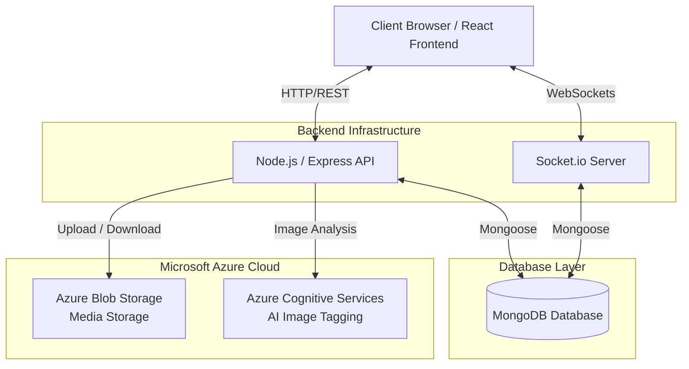

# EventHub Architecture

EventHub is built on a modern, highly scalable, real-time client-server architecture designed to handle media storage, real-time user interactions, and AI-driven image processing.

## High-Level Architecture Overview

The system is divided into four distinct layers:

1. **Client Browser (Frontend)**
2. **Backend Infrastructure**
3. **Database Layer**
4. **Cloud Services (Microsoft Azure)**

---

## 1. Client Browser / React Frontend
The frontend is a Single Page Application (SPA) built with React and Vite. It serves as the primary user interface.
- It communicates with the Backend API using standard **HTTP/REST** for all CRUD operations (creating events, fetching media, logging in).
- It establishes a persistent **WebSocket** connection to the backend to enable real-time updates (live notifications, immediate comment rendering, and like counters) without needing to refresh the page.

## 2. Backend Infrastructure
The backend operates as the central processing unit and API gateway for the entire platform. It consists of two main components running in parallel:
- **Node.js / Express API:** Handles authentication (JWT), routing, business logic, access control, and serves as the intermediary for cloud services.
- **Socket.io Server:** Manages real-time, bi-directional communication with the client browsers. It listens for events on the database or API level and broadcasts live updates to connected users.

## 3. Database Layer
- **MongoDB Database:** The primary persistent storage layer for the application. The Node.js API and Socket.io Server interact with the database using **Mongoose** (an Object Data Modeling library). It securely stores user profiles, event configurations, media metadata, comments, likes, and join requests.

## 4. Microsoft Azure Cloud
To ensure high availability and performance, heavy media assets and AI processing are offloaded to Microsoft Azure.
- **Azure Blob Storage (Media Storage):** When users upload high-resolution photos and videos, the Node.js API pipes these files directly into Azure Blob Storage. This keeps the backend server lightweight and ensures lightning-fast media delivery to clients.
- **Azure Cognitive Services (AI Image Tagging):** Upon image upload, the backend API transmits the image data to Azure Cognitive Services. This service runs deep learning models to automatically analyze the image, detect faces, and generate intelligent tags, which are then stored back in the MongoDB database for searchability.
