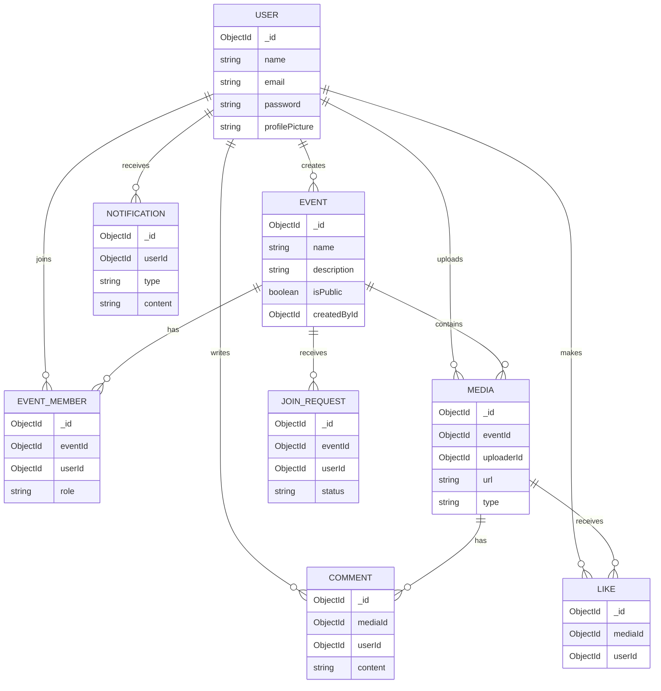

# Database Schema

EventHub uses **MongoDB**, a flexible NoSQL database, to store all application data. The data layer is managed in the Node.js backend using **Mongoose** for strict schema validation and relationship mapping.

## Entity-Relationship (ER) Diagram

Below is the database schema showcasing the relationships between Users, Events, Media, and Interactions:

## Collection Details

1. **User:** Stores authentication details, profile images, and core identity.
2. **Event:** The core entity representing a gathering or group. Events can be Public or Private.
3. **EventMember:** A junction collection tracking which Users belong to which Events, including their Role (Admin vs Viewer).
4. **Media:** Stores metadata, Azure storage URLs, and upload attribution for all Photos and Videos shared inside an event.
5. **JoinRequest:** Handles the queue for users attempting to join Private events.
6. **Like & Comment:** Tracks all social interactions attached to specific Media files.
7. **Notification:** Logs all alerts (Join approvals, new comments, etc.) to be delivered via WebSockets to specific users.
