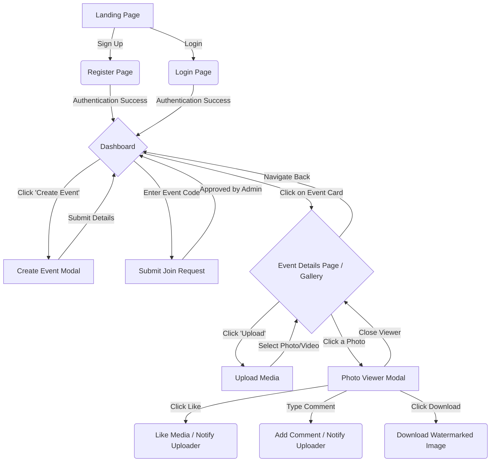

# User Flow

Below is the visual User Flow Diagram for EventHub. It maps out the complete journey a user takes from the moment they hit the landing page to interacting with media inside a specific event.

## User Journey Diagram

## Flow Description

1. **Authentication:** Users start at the Landing Page and flow into the Login or Register screens. Successful authentication routes them to the main Dashboard.
2. **Event Discovery:** From the Dashboard, users can either Create their own events (becoming an Admin) or Join existing events using a secure Event ID code (pending Admin approval).
3. **Engagement:** Once inside an Event's Details page, users can view the media gallery or directly upload their own photos and videos.
4. **Interaction:** Clicking any piece of media opens the Viewer Modal, where users can trigger real-time interactions (Likes and Comments) or securely download the file (which triggers the backend watermark pipeline).
